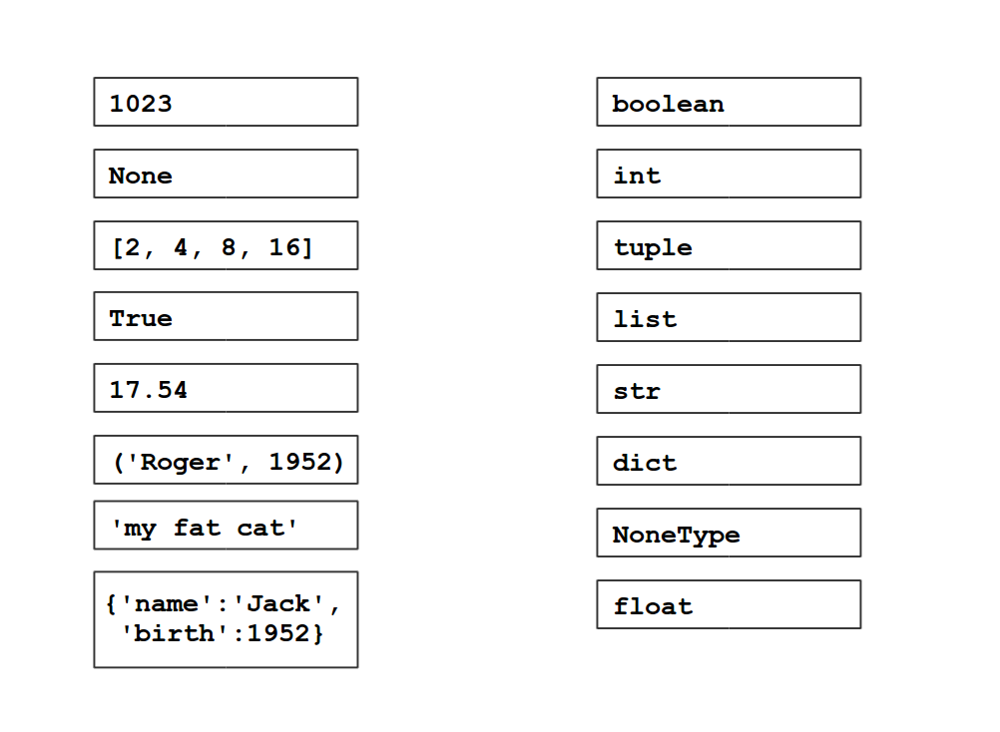

Data Types
==========

.. toctree::
   :maxdepth: 1

   numbers.rst
   strings.rst
   lists.rst
   tuples.rst
   indexing.rst
   dictionaries.rst

----

Overview
--------

========= ========================== ========= =======
data type description                composite mutable
========= ========================== ========= =======
int       integer numbers            no        no
float     floating-point numbers     no        no
string    characters                 no        no
bool      ``True`` or ``False``      no        no
list      sequence of items          yes       yes
tuple     immutable sequence         yes       no
dict      lookup table               yes       yes
set       collection of unique items yes       yes
NoneType  just nothing               no        no
========= ========================== ========= =======

**Composite** means that a data type contains other types.

**Immutable data types** cannot be modified.
Every modification creates a new instance.

Most of the composite data types are also **mutable**.
Their values can be modified.

----

Exercise
--------

Identify the data types in the picture:

