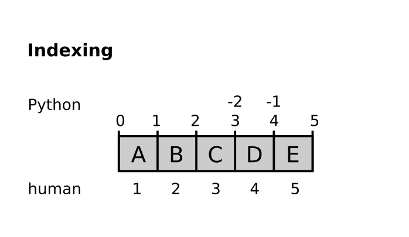
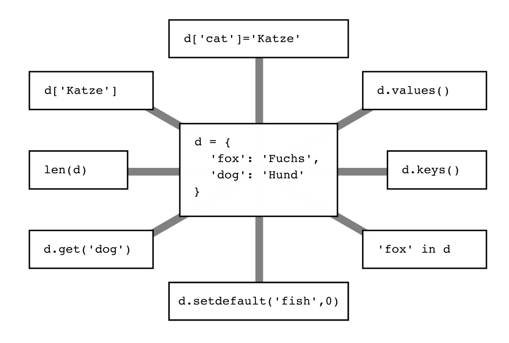

Exercises
=========

Exercise 1
~~~~~~~~~~

Identify the data types in the picture:

|image0|

--------------

Exercise 2
~~~~~~~~~~

Try out methods of **lists** by typing in the examples in the image.

|image1|

--------------

Exercise 3
~~~~~~~~~~

Discuss indexing and slicing of lists:

|image2|

--------------

Exercise 4
~~~~~~~~~~

Try out the methods of **dictionaries** as well.

|image3|

--------------

Reflection Questions
~~~~~~~~~~~~~~~~~~~~

-  can you use indexing and slicing on dictionaries?
-  what are lists good for?
-  what are dictionaries good for?
-  what is the difference between a function and a method?

.. |image0| image:: datatypes.png
.. |image1| image:: lists.png

