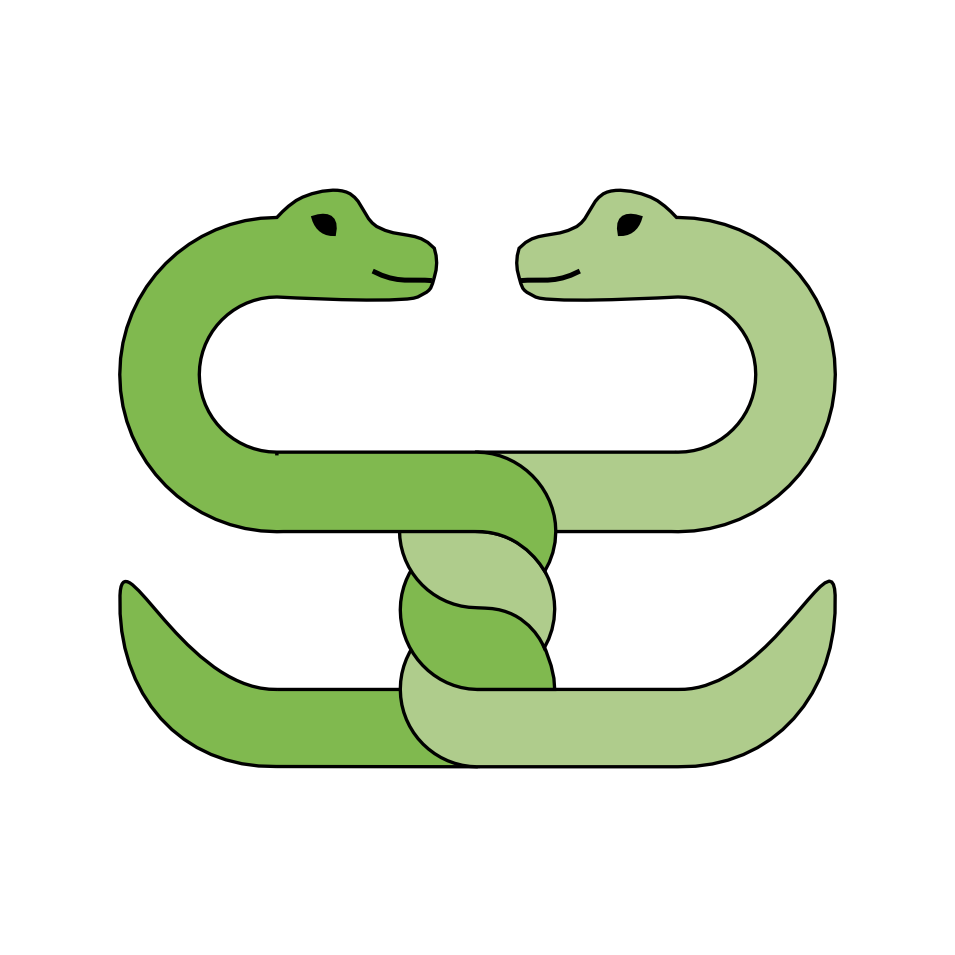

.. Python fundamentals documentation master file, created by

Python Fundamentals
===================

*course materials for a NobleProg course 03/23*

**by Kristian Rother**

Organizational Links
--------------------

* `Zoom Session <>`__
* `Spreadsheet for results <https://docs.google.com/spreadsheets/d/1Q9s-KTkw8_HvkJZO_hcMXw01m9w9HVGGBaAU8oZ4gsM/edit?usp=sharing>`__
* `NobleProg Course Outline <https://www.nobleprog.ro/en/cc/pyprfu/>`__

----

Contents
--------

.. toctree::
   :maxdepth: 2

   python_language/README.rst
   data_structures/README.rst
   input_output/README.rst
   control_flow/README.rst
   functions/README.rst
   classes/README.rst
   structuring_programs/README.rst

   structuring_code/README.rst
   structuring_code/builtin_functions.rst
   text/README.rst

   numpy_example/README.rst
   data_analysis/README.rst
   useful_libraries/README.rst

----

Appendix
--------

.. toctree::
   :maxdepth: 1

   faq.rst
   cheat_sheets/README.rst
   links.rst

----

License
-------

© 2023 Dr. Kristian Rother

All written material in this repository is released under the Creative Commons Attribution Share Alike License 4.0.
Code can be used under the conditions of the MIT License.

See :download:`AUTHORS.TXT` and :download:`LICENSE` for details.
