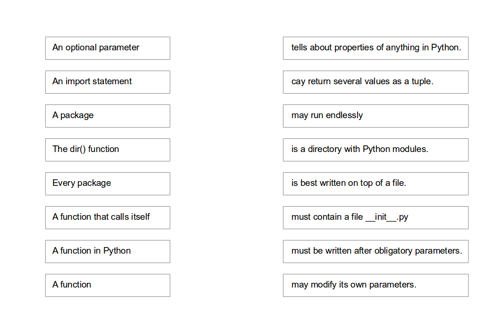

# Builtin Functions

### Exercise 1

Try out the following builtin functions on the Python command line.
Look up their usage in the documentation.

    group A        group B        group C        group D
    =======        =======        =======        =======
    min            max            abs            help
    range          sum            round          type
    open           enumerate      zip            dir
    

----

### Exercise 2

Match the pairs:

